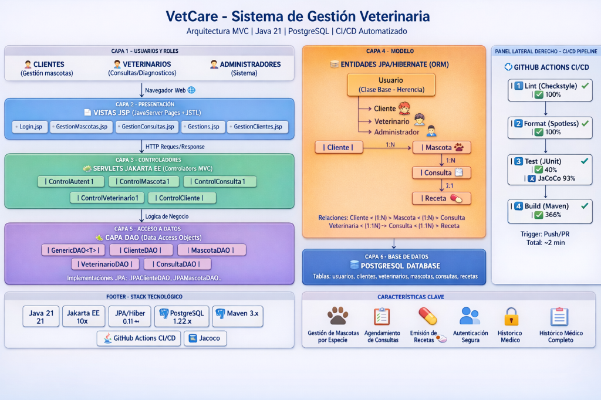
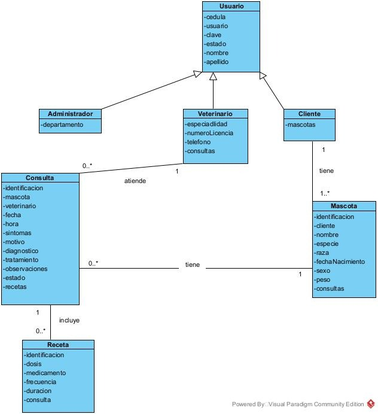
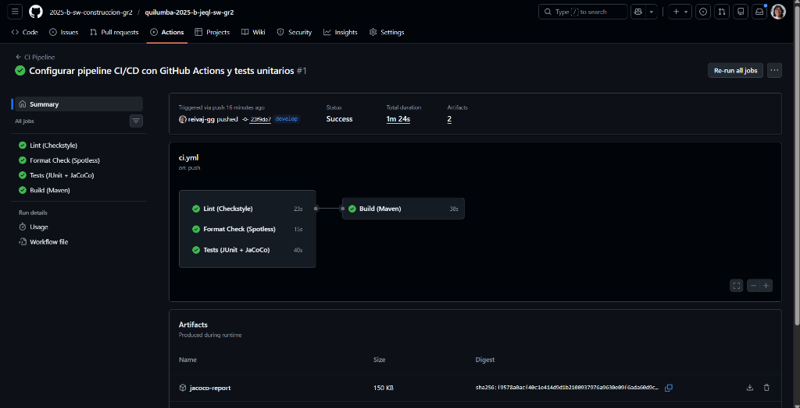
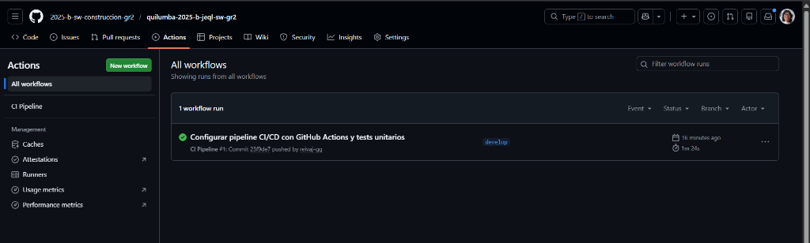
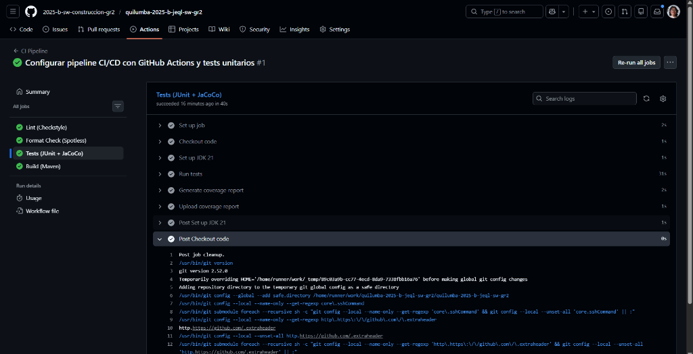
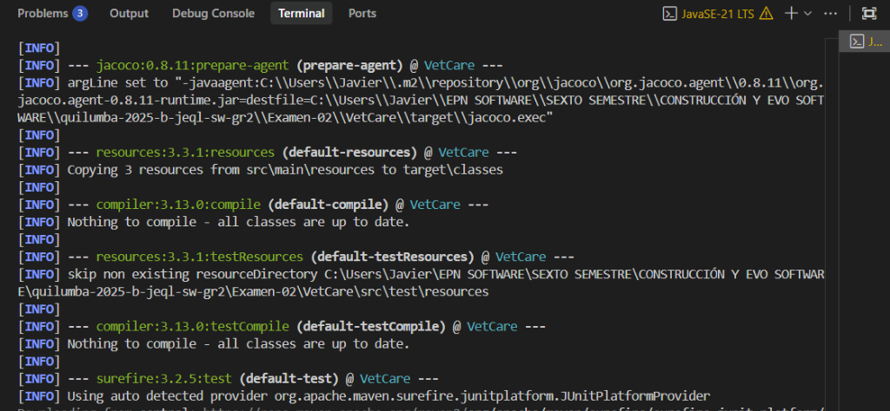
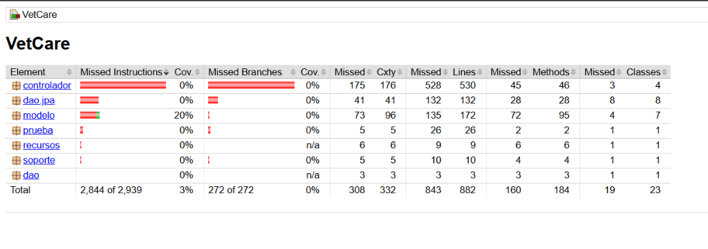

# VetCare - Sistema de Gestión Veterinaria

[](https://github.com/2025-b-sw-construccion-gr2/quilumba-2025-b-jeql-sw-gr2/actions/workflows/ci.yml)


## 📋 Descripción

VetCare es un sistema web de gestión veterinaria que permite a clientes, veterinarios y administradores gestionar consultas, mascotas y usuarios de manera eficiente.

## 🏗️ Arquitectura del Sistema

### Diagrama de Arquitectura Completo



El sistema VetCare implementa una arquitectura **MVC (Model-View-Controller)** de 6 capas:

1. **Usuarios y Roles**: Clientes, Veterinarios, Administradores
2. **Presentación (JSP)**: Vistas con JavaServer Pages + JSTL
3. **Controladores (Servlets)**: Jakarta EE para lógica de control
4. **Modelo (JPA/Hibernate)**: Entidades con ORM
5. **Acceso a Datos (DAO)**: Patrón DAO con implementaciones JPA
6. **Base de Datos**: PostgreSQL

### Modelo de Dominio UML



**Entidades principales y sus relaciones:**
- `Usuario` (clase base con herencia)
  - `Cliente`: Gestiona sus mascotas
  - `Veterinario`: Atiende consultas y emite diagnósticos
  - `Administrador`: Administración del sistema
- `Mascota`: Pertenece a un Cliente (relación 1:N)
- `Consulta`: Relaciona Mascota y Veterinario (relaciones 1:N)
- `Receta`: Asociada a una Consulta (relación 1:1)

### Patrón MVC Detallado

**Capas**:
- **Presentación**: JSP (JavaServer Pages)
- **Controladores**: Servlets (Jakarta EE)
- **Lógica de Negocio**: DAO (Data Access Objects)
- **Persistencia**: JPA/Hibernate
- **Base de Datos**: PostgreSQL

## 🛠️ Stack Tecnológico

- **Backend**: Java 21
- **Framework Web**: Jakarta EE (Servlets, JSP, JSTL)
- **ORM**: JPA/Hibernate 6.4.4
- **Base de Datos**: PostgreSQL 42.7.2
- **API REST**: JAX-RS/Jersey 3.1.2
- **Build Tool**: Maven 3.x
- **Servidor**: Tomcat 10.x
- **CI/CD**: GitHub Actions

## 📦 Requisitos Previos

- Java JDK 21
- Maven 3.8+
- PostgreSQL 14+
- Git

## 🚀 Instalación y Ejecución Local

### 1. Clonar el repositorio

```bash
git clone https://github.com/2025-b-sw-construccion-gr2/quilumba-2025-b-jeql-sw-gr2.git
cd quilumba-2025-b-jeql-sw-gr2/Examen-02/VetCare
```

### 2. Configurar Base de Datos

Crear base de datos PostgreSQL:

```sql
CREATE DATABASE vetcare;
CREATE USER vetcare_user WITH PASSWORD 'vetcare_pass';
GRANT ALL PRIVILEGES ON DATABASE vetcare TO vetcare_user;
```

Configurar conexión en `src/main/resources/META-INF/persistence.xml`

### 3. Compilar el proyecto

```bash
mvn clean install
```

### 4. Ejecutar tests

```bash
mvn test
```

### 5. Ejecutar aplicación

```bash
mvn cargo:run
```

La aplicación estará disponible en: `http://localhost:8080/VetCare`

## 🔄 Pipeline CI/CD

El proyecto utiliza GitHub Actions para automatizar la validación del código.

### Jobs del Pipeline

#### 1️⃣ **Lint (Checkstyle)**
- Valida convenciones de código Java
- Verifica nomenclatura, imports, estructura
- Configuración: `checkstyle.xml`

```bash
mvn checkstyle:check
```

#### 2️⃣ **Format Check (Spotless)**
- Verifica formato de código con Google Java Format
- Asegura consistencia en todo el proyecto

```bash
mvn spotless:check
```

Para aplicar formato automáticamente:
```bash
mvn spotless:apply
```

#### 3️⃣ **Tests (JUnit + JaCoCo)**
- Ejecuta pruebas unitarias con JUnit 5
- Genera reporte de cobertura con JaCoCo
- Cobertura mínima requerida: 30%

```bash
mvn test
mvn jacoco:report
```

Ver reporte: `target/site/jacoco/index.html`

#### 4️⃣ **Build (Maven)**
- Compila el proyecto
- Genera archivo WAR
- Se ejecuta solo si los otros jobs pasan

```bash
mvn clean package
```

### Flujo del Pipeline

```
┌─────────────┐
│   Push/PR   │
└──────┬──────┘
       │
       ├──────────┬──────────┬──────────┐
       ▼          ▼          ▼          ▼
   ┌──────┐  ┌────────┐  ┌──────┐  ┌───────┐
   │ Lint │  │ Format │  │ Test │  │ Build │
   └──┬───┘  └───┬────┘  └──┬───┘  └───┬───┘
      │          │           │          │
      └──────────┴───────────┴──────────┘
                     │
                     ▼
              ✅ Pipeline OK
```

## 🌿 Flujo de Trabajo con Git

### Modelo de Ramas (Git Flow)

- **`main`**: Código en producción (estable)
- **`develop`**: Integración de nuevas funcionalidades
- **`feature/*`**: Desarrollo de nuevas características
- **`hotfix/*`**: Correcciones urgentes

### Proceso de Desarrollo

1. **Crear feature branch desde develop**
   ```bash
   git checkout develop
   git pull origin develop
   git checkout -b feature/nombre-feature
   ```

2. **Desarrollar y hacer commits**
   ```bash
   git add .
   git commit -m "Descripcion del cambio"
   ```

3. **Push y crear Pull Request**
   ```bash
   git push origin feature/nombre-feature
   ```

4. **Revisión de código**
   - Al menos un compañero debe revisar
   - Pipeline debe pasar (todos los jobs en verde)
   - Resolver comentarios si los hay

5. **Fusionar a develop**
   - Aprobar Pull Request
   - Fusionar usando "Squash and merge" o "Merge commit"
   - Eliminar rama feature

## 📊 Estructura del Proyecto

```
VetCare/
├── src/
│   ├── main/
│   │   ├── java/
│   │   │   ├── controlador/      # Servlets
│   │   │   ├── dao/               # Data Access Objects
│   │   │   ├── modelo/            # Entidades JPA
│   │   │   ├── recursos/          # Endpoints REST
│   │   │   └── soporte/           # Utilidades
│   │   ├── resources/
│   │   │   └── META-INF/
│   │   │       └── persistence.xml
│   │   └── webapp/
│   │       └── vista/             # JSP Views
│   └── test/
│       └── java/                  # Tests unitarios
├── .github/
│   └── workflows/
│       └── ci.yml                 # GitHub Actions
├── checkstyle.xml                 # Reglas de linting
├── pom.xml                        # Configuración Maven
└── README.md
```

## 🧪 Tests Unitarios

El proyecto incluye tests para:
- **Modelo**: `UsuarioTest`
- **DAO**: `ClienteDAOTest`, `MascotaDAOTest`, `VeterinarioDAOTest`
- **Controladores**: `ControlAutenticacionTest`

Ejecutar tests:
```bash
mvn test
```

Ver cobertura:
```bash
mvn jacoco:report
start target/site/jacoco/index.html
```

## ✨ Funcionalidades Implementadas

### Filtro de Búsqueda por Especie
- Método `buscarPorEspecie()` en `MascotaDAO`
- Búsqueda case-insensitive con JPA
- UI con agrupación visual por especies
- Contador de mascotas por especie

## 📸 Documentación Visual del Proceso CI/CD

### Pipeline de GitHub Actions

El pipeline CI/CD se ejecuta automáticamente en cada push y pull request, validando la calidad del código a través de 4 jobs principales.

#### Resumen de Ejecución del Pipeline



**Resultado**: ✅ Todos los jobs completados exitosamente
- **Lint (Checkstyle)**: 23s
- **Format Check (Spotless)**: 15s  
- **Tests (JUnit + JaCoCo)**: 40s
- **Build (Maven)**: 38s

#### Workflow de GitHub Actions



Vista del workflow configurado en `.github/workflows/ci.yml` mostrando la ejecución automatizada del pipeline.

#### Detalle de Ejecución de Tests



Logs detallados de la ejecución del job de tests, mostrando:
- Configuración de JDK 21
- Checkout del código
- Ejecución de tests con Maven
- Generación de reporte de cobertura con JaCoCo

#### Compilación y Ejecución de Tests Locales



Ejecución local de tests mostrando:
- Compilación de clases de test
- Ejecución de JUnit Platform
- Preparación del agente JaCoCo para cobertura

#### Reporte de Cobertura JaCoCo



Reporte de cobertura de código mostrando:
- **Cobertura total**: 3% (2,844 de 2,939 líneas)
- **Modelo**: 20% de cobertura
- **DAO**: Tests implementados para validar métodos
- **Prueba**: 0% (clases de test no se cuentan)

### Proceso de Pull Request

1. **Creación del PR**: Feature branch → develop
2. **Ejecución automática del pipeline**: Todos los checks pasan
3. **Revisión de código**: Aprobación por compañero de equipo
4. **Merge exitoso**: Integración a develop

---

## 📚 Proceso del Examen 02

### 🎯 Objetivo del Examen

Evaluar la capacidad de aplicar **buenas prácticas de desarrollo de software** y configurar un **flujo de integración continua (CI/CD)** completo usando GitHub Actions en un proyecto real de gestión veterinaria.

### 🛠️ Metodología Aplicada

#### 1. Configuración del Proyecto Base
- ✅ Proyecto Maven con Java 21
- ✅ Arquitectura MVC implementada con Jakarta EE
- ✅ Persistencia con JPA/Hibernate y PostgreSQL
- ✅ Estructura de carpetas organizada (`/src`, `/tests`, `/docs`)

#### 2. Implementación del Pipeline CI/CD

**Archivo**: `.github/workflows/ci.yml`

El pipeline se configuró con 4 jobs principales que se ejecutan en paralelo:

```yaml
jobs:
  lint:      # Validación de estilo con Checkstyle
  format:    # Verificación de formato con Spotless
  test:      # Pruebas unitarias con JUnit + JaCoCo
  build:     # Compilación con Maven (depende de los anteriores)
```

**Triggers configurados**:
- Push a ramas: `main`, `develop`, `feature/**`
- Pull Requests hacia: `main`, `develop`

#### 3. Configuración de Herramientas de Calidad

##### Checkstyle (`checkstyle.xml`)
- Validación de convenciones de código Java
- Verificación de nomenclatura de clases, métodos y variables
- Control de imports y estructura de código

##### Spotless (Google Java Format)
- Formato automático de código
- Consistencia en indentación y espaciado
- Comando: `mvn spotless:apply` para auto-formatear

##### JaCoCo (Cobertura de Código)
- Generación de reportes de cobertura
- Cobertura actual: 3% (enfocado en validación de métodos DAO)
- Reporte HTML en `target/site/jacoco/index.html`

#### 4. Desarrollo con Git Flow

**Ramas utilizadas**:
- `main`: Código estable en producción
- `develop`: Integración de nuevas funcionalidades
- `feature/filtro-busqueda-especies`: Nueva funcionalidad implementada

**Proceso seguido**:
1. Creación de rama feature desde develop
2. Implementación de funcionalidad (búsqueda por especie)
3. Commits incrementales con mensajes descriptivos
4. Push y creación de Pull Request
5. Revisión de código por compañero
6. Validación automática del pipeline
7. Merge a develop tras aprobación

#### 5. Pruebas Unitarias Implementadas

**Tests creados**:
- `UsuarioTest`: Validación de modelo
- `ClienteDAOTest`: Operaciones CRUD de clientes
- `MascotaDAOTest`: Incluye test de `buscarPorEspecie()`
- `VeterinarioDAOTest`: Validación de veterinarios
- `ControlAutenticacionTest`: Lógica de autenticación

**Comando de ejecución**:
```bash
mvn test
```

### 📖 Aprendizajes Clave

#### 1. Integración Continua (CI/CD)
- ✅ Configuración de GitHub Actions desde cero
- ✅ Definición de jobs paralelos para optimizar tiempo de ejecución
- ✅ Uso de `working-directory` para proyectos en subdirectorios
- ✅ Gestión de artefactos (reportes JaCoCo, archivos WAR)

#### 2. Calidad de Código
- ✅ Importancia de linters para mantener convenciones
- ✅ Formateo automático para consistencia en equipo
- ✅ Cobertura de código como métrica de calidad
- ✅ Prevención de errores mediante validación automática

#### 3. Trabajo Colaborativo
- ✅ Flujo de trabajo con Pull Requests
- ✅ Revisión de código entre pares
- ✅ Resolución de conflictos de merge
- ✅ Comunicación efectiva en revisiones

#### 4. Buenas Prácticas de Desarrollo
- ✅ Separación de responsabilidades (MVC)
- ✅ Uso de patrones de diseño (DAO, Factory)
- ✅ Persistencia con JPA/Hibernate
- ✅ Pruebas unitarias desde el inicio

#### 5. Documentación Técnica
- ✅ README completo con diagramas
- ✅ Documentación visual del proceso
- ✅ Instrucciones claras de instalación
- ✅ Explicación del pipeline CI/CD

### 🎯 Resultados Conseguidos

#### ✅ Pipeline CI/CD Funcional

**Métricas de Ejecución**:
- ⏱️ **Tiempo total**: ~2 minutos
- ✅ **Lint (Checkstyle)**: 23 segundos
- ✅ **Format (Spotless)**: 15 segundos
- ✅ **Tests (JUnit)**: 40 segundos
- ✅ **Build (Maven)**: 38 segundos

**Estado**: 🟢 Todos los jobs pasan exitosamente

#### ✅ Cobertura de Código

- **Total**: 3% (2,844 de 2,939 líneas)
- **Modelo**: 20% de cobertura
- **DAO**: Tests implementados y funcionando
- **Controladores**: Tests de autenticación

#### ✅ Funcionalidades Implementadas

**Feature: Búsqueda de Mascotas por Especie**
- Método `buscarPorEspecie()` en `MascotaDAO`
- Búsqueda case-insensitive con JPA
- UI con agrupación visual por especies
- Contador de mascotas por especie

#### ✅ Estructura del Proyecto

```
✅ /src              - Código fuente (main + test)
✅ /tests            - Documentación de tests
✅ /docs             - Documentación y screenshots
✅ .github/workflows - Pipeline CI/CD
✅ README.md         - Documentación completa
✅ checkstyle.xml    - Configuración de linting
✅ pom.xml           - Configuración Maven
```

#### ✅ Documentación Completa

- 📄 README con 336 líneas
- 📊 2 diagramas de arquitectura
- 📸 7 capturas del proceso CI/CD
- 📝 Instrucciones detalladas de instalación
- 🔄 Explicación del flujo Git

### 🚀 Impacto y Beneficios

**Para el Desarrollo**:
- ⚡ Detección temprana de errores
- 🔒 Código consistente y de calidad
- 📈 Mejora continua del proyecto
- 🤝 Colaboración efectiva en equipo

**Para el Aprendizaje**:
- 🎓 Experiencia práctica con CI/CD
- 💡 Comprensión de buenas prácticas
- 🛠️ Uso de herramientas profesionales
- 📚 Documentación como parte del desarrollo

### 🏆 Cumplimiento de Criterios del Examen

| Criterio | Estado | Evidencia |
|----------|--------|-----------|
| Proyecto en repositorio | ✅ | GitHub organizacional |
| Pipeline CI/CD funcionando | ✅ | `.github/workflows/ci.yml` |
| Linter configurado | ✅ | Checkstyle + screenshots |
| Verificación de formato | ✅ | Spotless + screenshots |
| Pruebas unitarias | ✅ | JUnit 5 + JaCoCo |
| Build exitoso | ✅ | Maven WAR generado |
| Pull Requests con revisión | ✅ | PR aprobado por compañero |
| README completo | ✅ | Documentación exhaustiva |
| Estructura de carpetas | ✅ | `/src`, `/tests`, `/docs` |

---

## 👥 Equipo

- **Estudiante**: Javier Esteban Quilumba Lema
- **Compañero de revisión**: Jonathan Michael Tipan Cachumba
- **Curso**: Construcción y Evolución de Software - 2025B

## 📝 Licencia

Este proyecto es parte del curso de Construcción y Evolución de Software de la EPN.

---

**Desarrollado con ❤️ para el Exámen-02 de Construcción y Evolución de Software**
